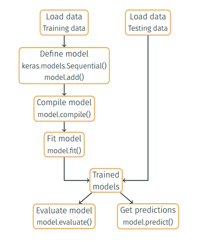
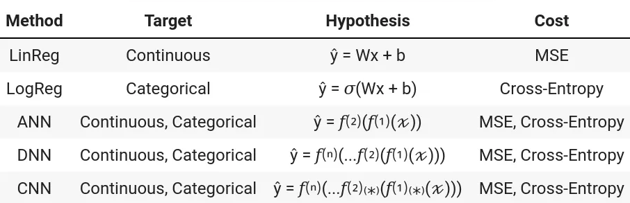

# Deep Learning 101

This repository presents the **basic notions** that involve the concept of Machine Learning and Deep Learning.

Read more in this post [ML & DL — Machine Learning and Deep Learning 101](https://medium.com/@mafda_/ml-dl-machine-learning-and-deep-learning-101-2686d93d70d).

## Configure environment

- Create the conda environment

```shell
(base)$: conda env create -f environment.yml
```

- Activate the environment

```shell
(base)$: conda activate deep_learning_101
```

- Run!

```shell
(deep_learning_101)$: python -m jupyter notebook
```

## Models

The models include a brief theoretical introduction and practical implementations developed using Python and Keras/TensorFlow in Jupyter Notebooks.

### Development Environment:

The development environment that will be used as one of the primary frameworks for machine learning and deep learning, alongside Python programming, is the Jupyter Notebook environment.



#### 1. Load Data

Load data (training and testing set):

```python
import tensorflow as tf

X_train, y_train = tf.keras.datasets.mnist.load_data()
X_test, y_test = tf.keras.datasets.mnist.load_data()
```

#### 2. Define Model

Two models: [Sequential](https://keras.io/getting-started/sequential-model-guide/) and [Functional API](https://keras.io/getting-started/functional-api-guide/).

Sequential used to stack layers:
* `model.add()` used to add the layers.
* `input_shape =()` specify the input form.

```python
model = tf.keras.models.Sequential()
model.add(layer1 …, input_shape=(nFeatures))
model.add(layer2 … )
```

#### 3. Compile Model

Configure the learning process by specifying:

* [`optimizer`](https://keras.io/optimizers) which determines how weights are updated,
* [Cost function](https://keras.io/losses) or `loss` function,
* [`metrics`](https://keras.io/metrics) to evaluate during training and testing.

```python
model.compile(optimizer='SGD', loss='mse', metrics=['accuracy'])
```

#### 4. Fit Model

Start the training process.

* `batch_size`: divide the data set into a number of batches.
* `epochs`: number of times the data set is trained completely.

```python
model.fit(X_train, y_train, batch_size=500, epochs=1)
```

#### 5. Evaluate Model

Evaluate the performance of the model.

* `model.evaluate()` finds the specified loss and metrics, and it provides a **quantitative** measure of accuracy.
* `model.predict()` finds the output for the provided test data and it is useful to check the outputs **qualitatively**.

```python
history = model.evaluate(X_test, y_test)
y_pred = model.predict(X_test)
```

* [ML & DL — Development environment (Part 1)](https://mafda.medium.com/ml-dl-development-environment-part-1-5bb0b35750aa)

### Accuracy results

|  Model |  Architecture |         Activation | Parameters | Accuracy |
| -----: | ------------: | -----------------: | ---------: | -------: |
| LogReg |            -- |                 -- |       7850 |   0.9282 |
|    ANN |          [32] |          [sigmoid] |      25450 |   0.9636 |
|    DNN |     [128, 64] |       [relu, relu] |      25450 |   0.9801 |
|    CNN | [32, 64, 128] | [relu, relu, relu] |      25450 |   0.9898 |

### Target - Hypothesis - Cost



### Theoretical introduction (https://mafda.medium.com):

* [ML & DL — Linear Regression (Part 2)](https://mafda.medium.com/ml-dl-linear-regression-part-2-14f114f2d62a)
* [ML & DL — Logistic Regression (Part 3)](https://mafda.medium.com/ml-dl-logistic-regression-part-3-fe6aca8f01b)
* [ML & DL — Artificial Neural Networks (Part 4)](https://mafda.medium.com/ml-dl-artificial-neural-networks-part-4-619350a93ef1)
* [ML & DL — Deep Neural Networks (Part 5)](https://mafda.medium.com/ml-dl-deep-artificial-neural-networks-part-5-568ad05be712)
* [ML & DL — Convolutional Neural Networks (Part 6)](https://mafda.medium.com/ml-dl-convolutional-neural-networks-part-6-97357db58165)

### Practical implementations (Jupyter Notebooks):

* [Linear Regression](https://github.com/mafda/deep_learning_101/blob/master/src/01-linear-regression.ipynb)
* [Logistic Regression](https://github.com/mafda/deep_learning_101/blob/master/src/02-logistic-regression.ipynb)
* [Artificial Neural Networks](https://github.com/mafda/deep_learning_101/blob/master/src/03-artificial-neural-networks.ipynb)
* [Deep Neural Networks](https://github.com/mafda/deep_learning_101/blob/master/src/04-deep-neural-networks.ipynb)
* [Convolutional Neural Networks](https://github.com/mafda/deep_learning_101/blob/master/src/05-convolutional-neural-networks.ipynb)
  

## [pt-BR] Presentation

* [deep-learning-101.pdf](https://github.com/mafda/deep_learning_101/blob/master/pdf/deep-learning-101.pdf)

## References

* Complete Post Medium
  * [ML & DL — Machine Learning and Deep Learning 101](https://mafda.medium.com/ml-dl-machine-learning-and-deep-learning-101-2686d93d70d)

* Book
  * [Deep Learning Book](http://www.deeplearningbook.org/)

---

made with 💙 by [mafda](https://mafda.github.io/)
